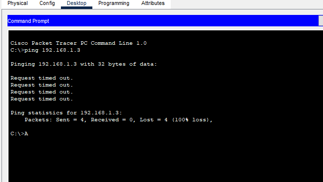
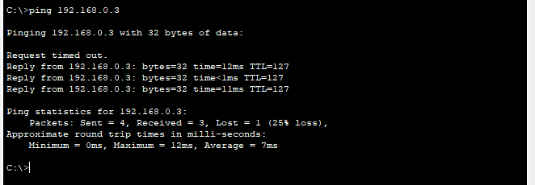

Sebelum router dikonfigurasi, proses ping dari PC B ke PC A gagal karena paket data tidak dapat mencapai tujuan hal ini disebabkan belum adanya rute komunikasi antar jaringan, sehingga router tidak mengetahui ke mana harus mengirim paket tersebut. Setelah router dikonfigurasi dengan benar, ping dari PC A ke PC B berhasil, menandakan bahwa koneksi antar jaringan sudah aktif dan routing telah berjalan dengan baik. Perbedaan ini menunjukkan bahwa konfigurasi router sangat penting agar perangkat pada jaringan berbeda dapat saling berkomunikasi melalui proses routing yang tepat.

#Gambar sebelum konfigurasi

#Gambar Sesudah konfigurasi

#Link Yt

https://youtu.be/LN4WCD77qjo
